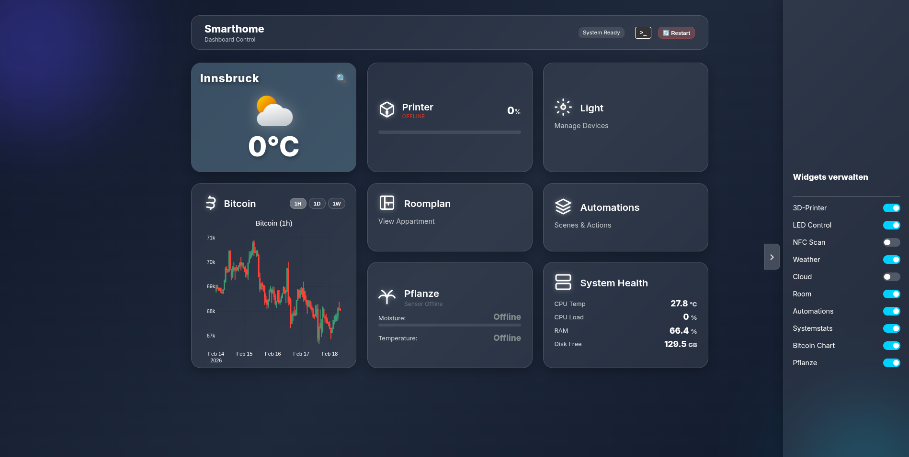

# SmartHome Dashboard - Web-Based IoT Control Center

> **Status**
> 
> Dieses Projekt ist für den Einsatz auf einem **Raspberry Pi** konzipiert und dient als zentrale Steuerzentrale für ein lokales Smart Home Ökosystem.
> 
> *Hinweis: Diese Software steuert physische Hardware (Lichter, 3D-Drucker) und greift tief in Systemprozesse ein.*

Dieses Repository enthält den Quellcode für das **"SmartHome Dashboard"**. Die Webanwendung ermöglicht die zentrale Steuerung von BLE-Lichtsystemen, die Überwachung von 3D-Druckern (Bambu Lab), Raumklima-Analyse sowie komplexe, sensorbasierte Automatisierungen über eine moderne "Glassmorphism" Benutzeroberfläche.

## Inhaltsverzeichnis
1. [Installation](#installation)
2. [Ausführung](#ausführung)
3. [Bedienung des User Interface](#bedienung-des-user-interface)
4. [Umgesetzte Features](#umgesetzte-features)
5. [Softwarestruktur & Implementierung](#softwarestruktur--implementierung)
6. [Herausforderungen & Lösungen](#herausforderungen--lösungen)

---

## Installation

### Voraussetzungen
Stellen Sie sicher, dass folgende Hardware und Software vorhanden ist:
* **Raspberry Pi** (3B+ oder 4/5 empfohlen für BLE-Stabilität)
* **Python** (Version 3.9 oder neuer)
* **BlueZ** (Bluetooth Stack für Linux)
* Ein funktionierender MQTT Broker (für Sensoren/Drucker)

### Schritte

1. **Repository klonen**
   ```bash
   git clone [https://github.com/kunzechriz/smarthome.git](https://github.com/kunzechriz/smarthome.git)
   cd smarthome
   ```

2. **Abhängigkeiten installieren**
   Es wird dringend empfohlen, eine virtuelle Umgebung (`venv`) zu nutzen, um System-Pakete nicht zu stören:
   ```bash
   python3 -m venv venv
   source venv/bin/activate
   pip install -r requirements.txt
   ```

3. **Individuelle Konfiguration**
   Vor dem ersten Start müssen einige lokale Parameter an das eigene Netzwerk angepasst werden:
   * **Anwesenheitserkennung:** Die feste IP-Adresse des Smartphones in `backend/automation_controls.py` eintragen.
   * **3D-Drucker:** IP-Adresse, Seriennummer und Access-Code des Bambu Lab Druckers in `backend/printer.py` hinterlegen.
   * **System-Restart:** Damit der Neustart über das Dashboard funktioniert, muss dem Pi-User via `sudo visudo` die Berechtigung für den Systemd-Dienst (z.B. `NOPASSWD: /usr/bin/systemctl restart dashboard`) erteilt werden.

## Ausführung

### Entwicklungs-Modus (für Tests & Debugging)
```bash
python app.py
```
Das Dashboard ist nun lokal erreichbar unter: `http://<IP-DES-PI>:5001`

### Produktions-Betrieb (Empfohlen)
Für den stabilen 24/7-Betrieb läuft das Backend über **Gunicorn**, welches als Systemd-Service (`dashboard.service`) im Hintergrund ausgeführt wird:
```bash
sudo systemctl start dashboard
```

## Bedienung des User Interface



* **Dashboard**: Die Startseite bietet Widgets für Wetter, Bitcoin-Kurs, Systemstatus (CPU/Temp) und Schnellzugriff auf Lichtszenen.
* **Geräte-Liste**: Scannt und verbindet sich via Bluetooth Low Energy (BLE) mit umliegenden LED-Controllern.
* **3D-Drucker Panel**: Zeigt Live-Daten (Nozzle/Bed Temperatur, Fortschritt) des Bambu Lab Druckers an und ermöglicht Fernsteuerung (Licht, Pause, Stop).

### 1. Automatisierung
Das System entscheidet autonom über Lichtzustände basierend auf:
* **Helligkeit**: Lux-Sensor Werte (via ESP32/MQTT).
* **Anwesenheit**: Ping-basierte Erkennung des Smartphones im WLAN.
* **Manueller Override**: Das System respektiert manuelle Eingriffe des Nutzers.

### 2. Admin-Tools & Logs
* **Live-Log**: Ein Terminal-Fenster in der UI zeigt Backend-Prozesse (Gunicorn Logs, Automation-Entscheidungen) in Echtzeit.
* **System-Restart**: Der Server kann direkt über die UI neu gestartet werden.

## Umgesetzte Features

Dieses Dashboard vereint verschiedene Hardware-Komponenten und Sensoren in einer zentralen, reaktiven Weboberfläche (Vanilla JS & Flask). Folgende Hauptfunktionen wurden umgesetzt:

* 💡 **Intelligente Lichtsteuerung (BLE & Automatisierung)**
  * Direkte Steuerung lokaler Bluetooth-Leuchtmittel (Power, Farbwahl, Gruppen) über asynchronen Python-Code (`bleak`).
  * **Welcome-Home-Automatik:** Intelligente Verknüpfung von lokaler Anwesenheitserkennung (Ping-Überwachung des Smartphones) und Raumhelligkeit.
  * **Manual Override:** Manuelle Schalteingriffe im Dashboard pausieren die Automatik temporär, bis das Haus wieder verlassen wird.
* 🖨️ **3D-Drucker Monitor (Bambu Lab)**
  * Live-Auswertung der Drucker-Telemetrie via lokalem MQTT (Nozzle-/Bed-Temperatur, Druckfortschritt, Restzeit).
  * Fernsteuerung grundlegender Hardware-Befehle.
* 🌡️ **Klima, Sensoren & API-Widgets**
  * Auslesen von BLE-Pflanzensensoren (Bodenfeuchtigkeit & Temperatur).
  * Detailliertes Wetter-Widget (Open-Meteo API) mit dynamischer, wetterbasierter Hintergrundanpassung des Dashboards.
  * Live-Abruf aktueller Finanzdaten (Bitcoin-Chart).
* ⚙️ **System-Monitoring & Admin-Tools**
  * Live-Ressourcenüberwachung des Raspberry Pi (CPU-Last, RAM, Core-Temperatur).
  * Integrierter **Live-Log-Viewer** (Terminal-Simulation im Browser) zum Echtzeit-Tracking von Backend-Entscheidungen.
  * "1-Click" Server-Neustart direkt aus dem Web-Interface.
  * Bereitstellung eines NFC-Kartenlesers für zukünftige Admin-Freigaben.
* ☁️ **Cloud-Link**: Integration/Verlinkung zu einer lokalen Nextcloud-Instanz.

## Softwarestruktur & Implementierung

### Architektur
Das Backend basiert auf **Flask** und nutzt **Blueprints**, um die Funktionalitäten modular zu halten:
* **`backend/led.py`**: Handhabt den asynchronen BLE-Loop (`asyncio`) parallel zum Flask-Thread.
* **`backend/automation_controls.py`**: Enthält die Logik-Schleife (`threading`), die alle 5 Sekunden Sensordaten bewertet.
* **`backend/printer.py`**: Eigener MQTT-Client Thread für die Drucker-Kommunikation.

### Frontend-Technologie
Wir verzichten auf schwere Frameworks (React/Vue) und setzen auf **Vanilla JavaScript** für maximale Performance auf dem Raspberry Pi. Die Kommunikation erfolgt über REST-API Endpoints (`/api/...`), die asynchron (`fetch`) abgefragt werden, um die UI nicht zu blockieren.

## Herausforderungen & Lösungen

Während der Entwicklung traten verschiedene technische Hürden auf:

### 1. Gunicorn & Threading (Deploy)
* **Problem**: Beim Wechsel von `python app.py` auf Gunicorn (Produktion) starteten die Hintergrund-Threads (Drucker, Automation) nicht mehr, da Gunicorn den `__main__` Block ignoriert.
* **Lösung**: Umstrukturierung der `app.py`, sodass Start-Funktionen (`start_printer_service`) explizit im globalen Scope aufgerufen werden, damit sie beim Forken der Worker-Prozesse initialisiert werden.

### 2. Logik-Konflikt: Automatik vs. Mensch
* **Problem**: Wenn das Licht manuell ausgeschaltet wurde, schaltete die Dunkelheits-Automatik es sofort wieder an ("Es ist dunkel -> Licht an").
* **Lösung**: Implementierung eines **"Manual Override"** Status und eines **"Just Arrived"** Triggers.
    * Wenn der Nutzer manuell schaltet, wird die Automatik pausiert.
    * Wenn der Nutzer das Haus verlässt und wiederkommt, wird der Override resettet.
    * Die Anwesenheit hat Priorität ("Veto-Recht") über den Lichtsensor.

### 3. Asynchrones BLE vs. Synchrones Flask
* **Problem**: Die `bleak` Library für Bluetooth benötigt einen `asyncio` Event-Loop, während Flask traditionell synchron läuft. Dies führte zu "Blocking"-Problemen.
* **Lösung**: Auslagerung des BLE-Loops in einen separaten Thread, der über `asyncio.run_coroutine_threadsafe` Befehle aus den Flask-Routen entgegennimmt.

### 4. Live-Logging im Browser
* **Problem**: System-Logs (`print`, Fehler) waren nur im Terminal sichtbar, nicht im Dashboard.
* **Lösung**: Implementierung eines `WebStreamWrapper`, der `sys.stdout` und `sys.stderr` abfängt (Monkey Patching), die Nachrichten puffert und über einen API-Endpoint (`/api/logs`) an das Frontend streamt.
